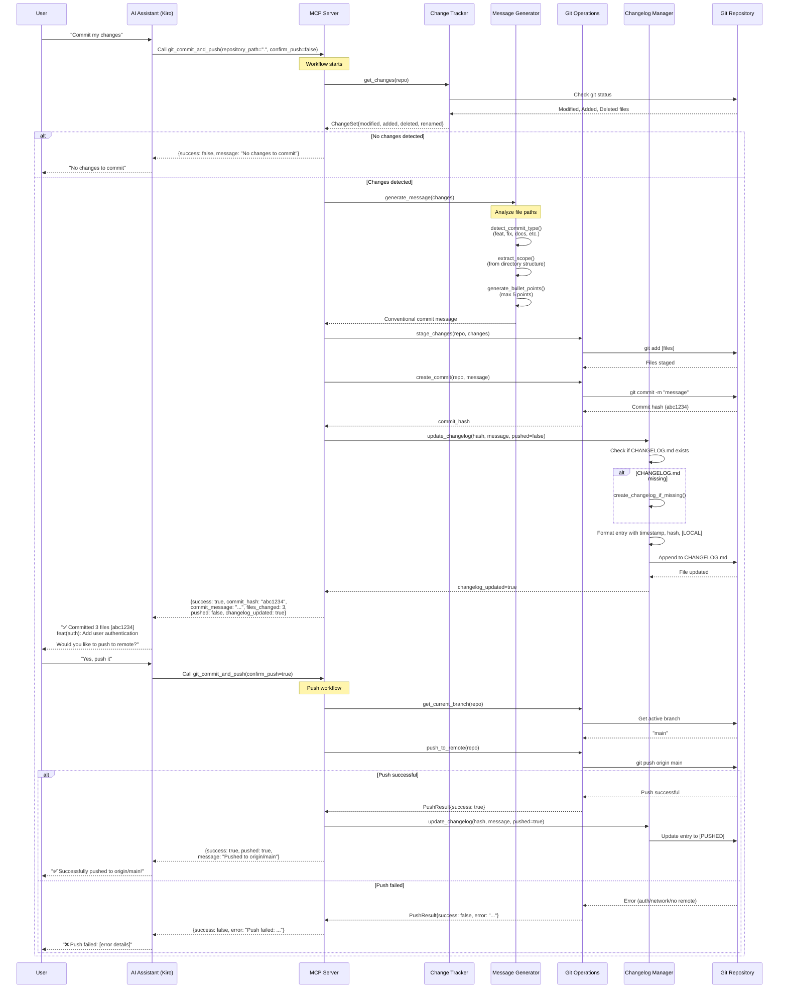
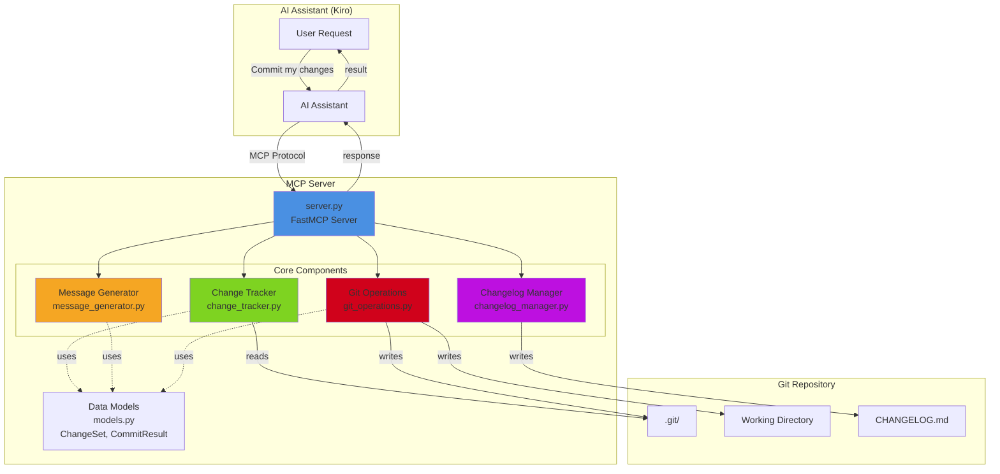
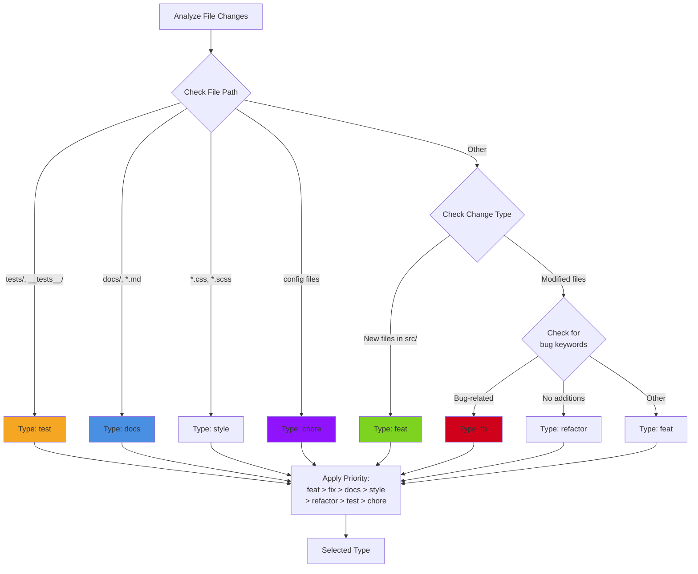
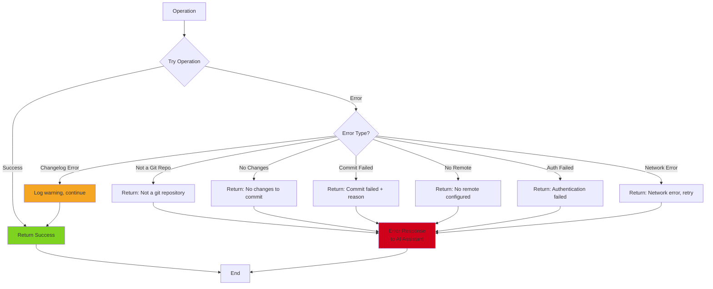

# Git Commit MCP Server - Architecture Flow

## End-to-End Flow Diagram



## Component Architecture



## Commit Type Detection Logic



## Changelog Update Flow

```mermaid
flowchart TD
    Start[Update Changelog] --> Exists{CHANGELOG.md<br/>exists?}
    
    Exists -->|No| Create[Create file with<br/>template headers]
    Exists -->|Yes| Read[Read existing content]
    
    Create --> Format
    Read --> Format[Format new entry]
    
    Format --> Entry["Entry Format:<br/>### YYYY-MM-DD HH:MM:SS - hash [STATUS]<br/><br/>commit message<br/><br/>- bullet points"]
    
    Entry --> Status{Pushed?}
    Status -->|Yes| Pushed["Status: [PUSHED]"]
    Status -->|No| Local["Status: [LOCAL]"]
    
    Pushed --> Insert
    Local --> Insert[Insert after<br/>'## [Unreleased]']
    
    Insert --> Write[Write to file]
    Write --> Done[✅ Changelog Updated]
    
    style Create fill:#7ED321
    style Format fill:#4A90E2
    style Write fill:#F5A623
    style Done fill:#7ED321
```

## Data Flow

```mermaid
graph LR
    subgraph Input
        RP[repository_path]
        CP[confirm_push]
    end
    
    subgraph Processing
        CS[ChangeSet<br/>modified: []<br/>added: []<br/>deleted: []<br/>renamed: []]
        
        CM[Commit Message<br/>type: feat<br/>scope: auth<br/>description: ...<br/>bullets: []]
        
        CR[CommitResult<br/>success: true<br/>commit_hash: abc1234<br/>files_changed: 3<br/>pushed: false<br/>changelog_updated: true]
    end
    
    subgraph Output
        Response[JSON Response<br/>to AI Assistant]
    end
    
    RP --> CS
    CS --> CM
    CM --> CR
    CP --> CR
    CR --> Response
    
    style CS fill:#4A90E2
    style CM fill:#F5A623
    style CR fill:#7ED321
```

## Error Handling Flow



## Key Features Summary

### 1. **Change Detection**
- Scans working directory for all changes
- Categorizes: modified, added, deleted, renamed
- Excludes untracked files from auto-commit

### 2. **Smart Message Generation**
- Analyzes file paths and extensions
- Determines commit type automatically
- Extracts scope from directory structure
- Generates up to 5 descriptive bullet points
- Follows Conventional Commits specification

### 3. **Git Operations**
- Stages all tracked changes
- Creates commit with generated message
- Handles push with user confirmation
- Comprehensive error handling

### 4. **Changelog Management**
- Creates CHANGELOG.md if missing
- Appends entries in reverse chronological order
- Tracks push status ([PUSHED] vs [LOCAL])
- Maintains professional format

### 5. **MCP Integration**
- Exposes `git_commit_and_push` tool
- Returns structured JSON responses
- Enables natural language Git workflows
- Works with any MCP-compatible AI assistant

